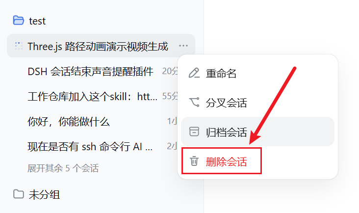
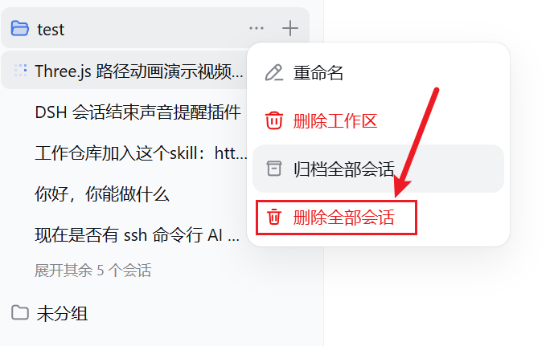

# dsh-session-delete

> 本仓库是 [@wenhao4126](https://github.com/wenhao4126) 的公开 fork。
> 上游仓库：[vtxf/dsh-session-delete](https://github.com/vtxf/dsh-session-delete)

[中文](#中文) | [English](#english)

## 预览





## 中文

DSH（DeepSeek Harness）工作区侧栏增强插件：补上官方缺失的**会话删除**能力，并增加目录级批量操作。

### 功能

| 入口 | 菜单项 | 行为 |
|---|---|---|
| 会话行 `…` 菜单 | **删除会话** | 永久删除该会话的全部本地记录（`~/.dsh/sessions/<项目目录>/<会话目录>/`，含日志文件），不可恢复 |
| 会话行 `…` 菜单 | **恢复全部已归档会话** | 把所有已归档会话恢复到各自原工作区；原工作区已删除时自动按会话项目目录重建 |
| 目录行 `…` 菜单 | **归档全部会话** | 一键归档该工作区下所有未归档会话（记录保留，仅隐藏） |
| 目录行 `…` 菜单 | **恢复归档会话** | 恢复该工作区下已归档会话到原工作区 |
| 目录行 `…` 菜单 | **删除全部会话** | 批量删除该工作区全部会话（含已归档） |

### 安全设计

- 红色危险确认对话框，明示"不可恢复"及目标数量
- **运行中/已打开的会话一律跳过**（含当前会话），防止误删活跃会话
- 删除命令运行在受限沙箱内（`workspace-write`，root 限定为该会话所属的项目目录）
- 先删文件、后做归档/账目簿记：任何失败都不会留下"已隐藏但未删除"的半删状态

### 安装

```bash
dsh plugin --profile web add dsh-session-delete
```

（自动加入 profile 的 `dsh.profile.bundles` 层，包内 `cordis.patch.yml` 随层生效，无需手动编辑。`web` 换成你的 profile 名。）

手动兜底（不使用 `dsh plugin` 时）：

```bash
cd ~/.dsh/profiles/web
pnpm add dsh-session-delete --registry https://registry.npmjs.org
```

然后在 `cordis.patch.yml` 添加挂载行（无需 config）：

```yaml
- insert:
    - id: dsh-session-delete
      name: dsh-session-delete
```

重启 DSH 生效。命令菜单文案自动跟随 GUI 语言（中文/英文）。

### 工作原理

- **Host 半**（`index.js`）：注册 `POST /dsh-session-delete/{delete,delete-all,archive-all,restore,restore-all}` 同源路由；删除经 `ctx.shell` 在按调用沙箱策略下执行（POSIX `rm` / Windows `Remove-Item` 自动分派，路径单引号转义防注入）；恢复会从归档集合移除会话，并按会话头 cwd 放回原工作区或重建工作区
- **Client 半**（`client.js`，`dsh.client` web bundle）：点击捕获 + React fiber 读取行数据；MutationObserver 在菜单挂载后克隆现有菜单项 DOM 注入新命令（样式/主题自动一致），操作经同源 `fetch` 调 Host 路由

> 注：浏览器半通过 DOM 增强注入菜单（官方未开放该菜单的扩展 Slot）。DSH 大版本升级若调整侧栏结构，插件可能需要跟进——菜单未注入时功能静默缺失，不会有其他影响。

### 兼容性

- DSH `0.1.0-rc.6`（依赖 `webServer` / `shell` / `sessionPersistence` / `workspaceRegistry` / `sessions` 服务）
- Linux / Windows（按会话路径分隔符自动分派删除命令）

## English

A DSH (DeepSeek Harness) sidebar enhancement plugin: adds the missing **session deletion** capability plus directory-level bulk operations.

- Session row menu → **Delete Session**: permanently removes the session's local records (log directory included)
- Session row menu → **Restore All Archived Sessions**: restores every archived session to its original workspace; if a workspace registration was deleted, it is recreated from the session's project directory
- Workspace row menu → **Archive All Sessions** / **Restore Archived Sessions** / **Delete All Sessions**

Safety: danger-styled confirmation dialog; live/opened sessions are always skipped; removal runs in a per-call sandbox (`workspace-write` scoped to the session's project directory); files are removed before any bookkeeping so a failure never leaves a half-deleted state.

Install: `dsh plugin --profile <name> add dsh-session-delete` (or `pnpm add dsh-session-delete` plus a manual `- insert: dsh-session-delete` row in `cordis.patch.yml`), restart DSH. UI language follows the GUI locale (zh/en).

## License

MIT
